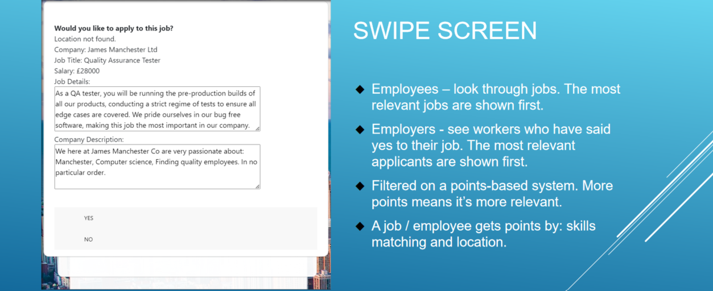
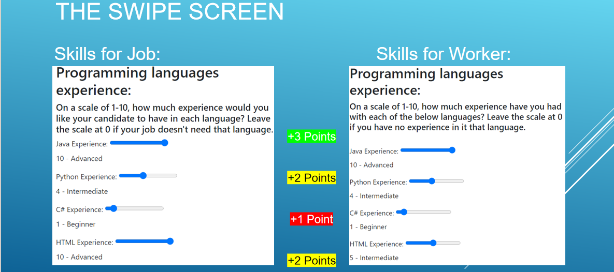
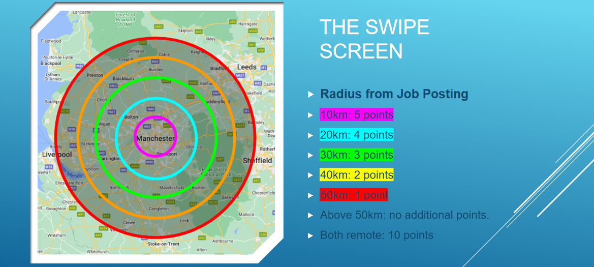

> A website to link employees and employers (specially designed for engineering students)

Job Assembler (C2C+B2C)
======

```
First-Year Team Project of CS Department | X17 Group 2021-2022 | University of Manchester 
```

## Introduction
 Our Project is a website designed to connect job seekers (employees) with potential employers in a user-friendly and engaging way. Unlike existing options such as LinkedIn, Indeed, and Reed, our platform offers a simpler and more interactive experience for both job seekers and employers.
 
### Empowering Informed Decision-Making for Students:
 Our platform is dedicated to helping students navigate the complex landscape of educational and career choices with ease. We understand that making decisions about education and career paths can be overwhelming. Our goal is to provide students with the tools and resources they need to make well-informed decisions at every stage of their journey. 

### Localization for Tailored Opportunities:
We recognize the importance of localized information when it comes to education and employment. Our platform prioritizes localization, starting near universities and educational institutions. By offering region-specific content, job listings, and networking opportunities, we ensure that students have access to opportunities that are relevant to their local community. 

## Features
- User-friendly job search and application process.
- Enhanced employer-employee matching algorithms.
- Interactive and engaging user interface.
- Robust employer profiles with company information and job listings.
- Employee profiles with customizable resumes and portfolios.
- Messaging and networking capabilities.
- Privacy and data security measures.

### Swipe  Screen Interface ---> Easy to Use



* This website is divided into the employer side and the employee side.
* Employees can apply for jobs and Employers can send offers/postings on this platform.
* Innovative features: Users can easily swipe cards to make their decisions(accept or reject), it's easier and more engaging than existing options

### Utilize the Map’s Recommendation Mechanism

* The recommendation algorithm weights the recommendations based on the distance between the employee and the recruiter.
* Based on Google Map API

## Getting Started

To get a local copy of this project up and running, follow these steps:

1. **Clone the repository**:
   
   ```bash
   git clone https://github.com/Ray7788/JobAssembler_Website.git
   ```


Please note we only deployed this website on University's server and if you have this access please login on Blackboard.

## How Did We Build It
We use:  PHP; JavaScript; HTML; CSS; SQL

**Other resources:**

Bootstrap 4;
Google Map API;
Ajax

### Database Design


## Privacy and Ethical Guidelines
### Data Protection & Collection:


### Ethical Guidelines
We follow [BCS Code of Conduct](https://www.bcs.org/membership-and-registrations/become-a-member/bcs-code-of-conduct/) and [The Ten Commandments of Computer Ethics](http://cpsr.org/issues/ethics/cei/) as our **ethical guidelines**.

## Future Expansion
We have ambitious plans to expand our platform's reach and functionality in the future:

- Geographical Expansion: We plan to extend our services to cover a wider geographical area, reaching more job seekers and employers.

- Feature Enhancements: Continuously improving our matching algorithms, user interface, and adding new features based on user feedback and industry trends.

- Mobile Applications: Developing mobile apps for both iOS and Android platforms to provide a seamless experience on mobile devices.

- Integration: Exploring partnerships and integrations with other job search and recruitment platforms to offer a broader range of opportunities.

## License
This project is licensed under the **MIT License**.